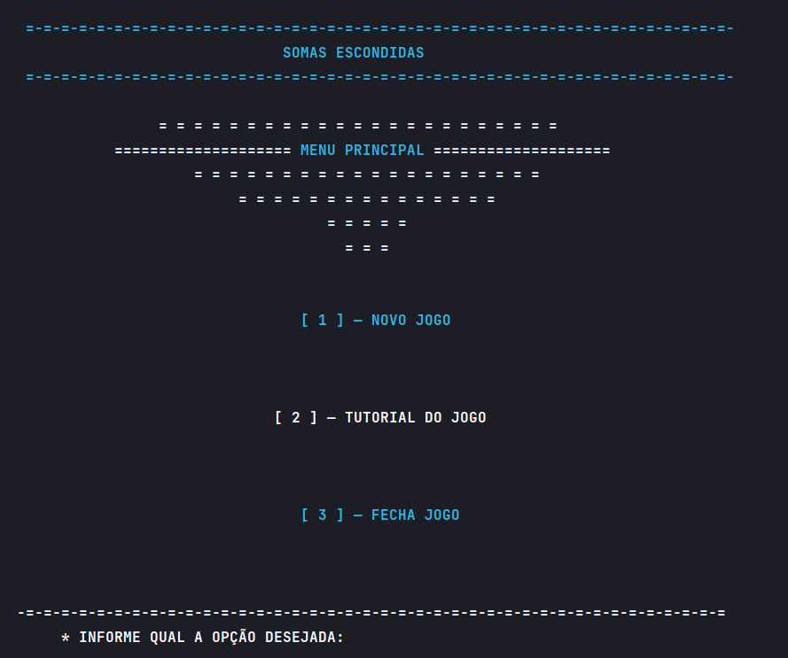
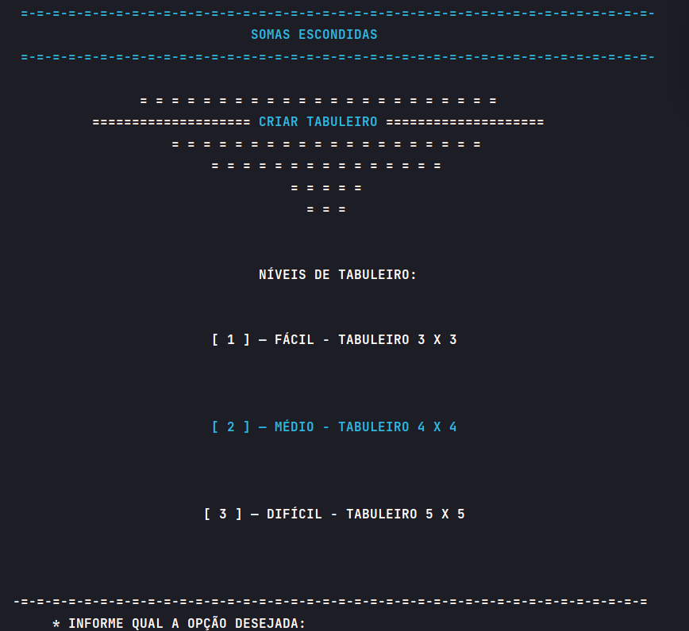
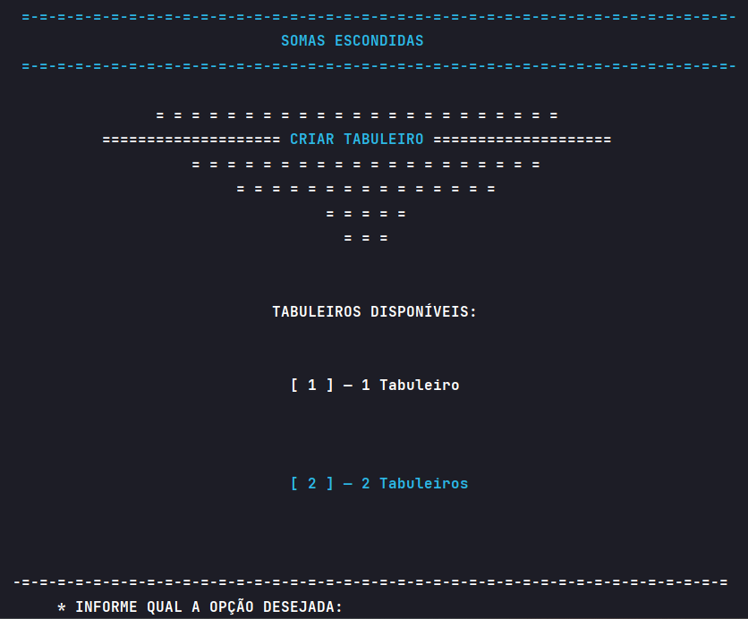
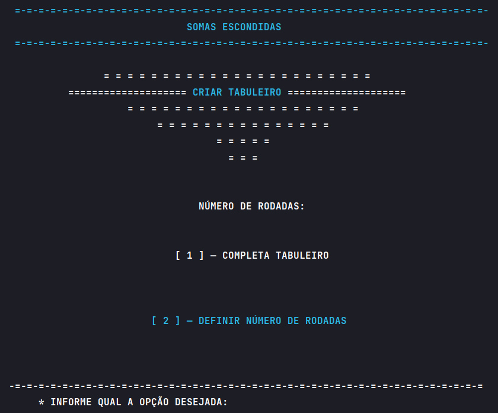
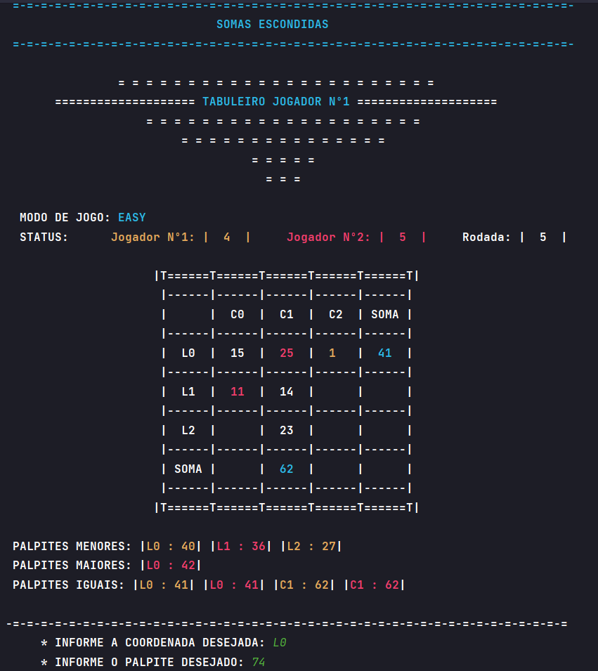
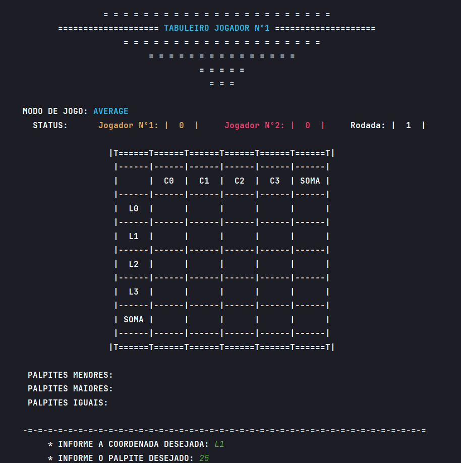

<h1 align="center">
  🧩 

Matrix Adivinhation
</h1>

# 📜 Descrição do Projeto

O "Jogo das Somas Esquecidas" é um jogo de tabuleiro, inspirado no desafio enfrentado por Neo em sua busca por inteligência real. O jogo pode ser disputado entre dois jogadores, Jogador 1 e Jogador 2, utilizando um ou dois tabuleiros, dependendo da preferência. Existem três níveis de dificuldade: Fácil, Médio e Difícil, cada um com dimensões de tabuleiro diferentes. Os tabuleiros são preenchidos com números aleatórios que não se repetem no mesmo tabuleiro, e os jogadores tentam adivinhar o valor das somas de linhas ou colunas ocultas para ganhar casas no tabuleiro.

# 📖 Regras do Jogo

## Níveis de Dificuldade

- Fácil: Tabuleiro 3x3, números de 1 a 30.
- Médio: Tabuleiro 4x4, números de 1 a 60.
- Difícil: Tabuleiro 5x5, números de 1 a 100.

## Condições de Encerramento

Uma partida pode ser encerrada de duas maneiras:

1. Número de Rodadas: Deve ser ímpar.
2. Tabuleiro Completo: Quando todas as casas do tabuleiro estão reveladas.

## Gameplay

- Cada jogador escolhe um tabuleiro (um ou dois, dependendo da escolha inicial).
- Os jogadores escolhem o nível de dificuldade e a condição de encerramento da partida.
- Em cada rodada, os jogadores escolhem uma linha ou coluna do tabuleiro e tentam adivinhar o valor da soma.
- A casa a ser revelada depende do valor chutado pelo jogador:
  - Se o valor chutado for menor que a soma, a casa revelada é a que contém o menor valor da linha ou coluna escolhida.
  - Se o valor chutado for maior que a soma, a casa revelada é a que contém o maior valor da linha ou coluna escolhida.
  - Se o valor chutado for igual à soma, todas as casas da linha ou coluna escolhida são reveladas.
- O jogador com mais casas reveladas quando a partida terminar será o vencedor.

# ⚙️ Demonstração da Aplicação

A interface de interação do usuário é feita através do prompt de comando (CMD).

## Funcionamento do sistema para exportar o menu principal:

  

<strong>Tela de menu principal</strong>

## Funcionamento do sistema para registrar uma nova partida:

  

<strong>Tela de escolha de nivel</strong>

  

<strong>Tela de escolha de número de tabuleiros</strong>

  

<strong>Tela de escolha de número de rodadas</strong>

## Funcionamento do sistema para os 3 modos de jogo:

  

<strong>Tela de uma rodada do jogo em modo fácil</strong>

  

<strong>Tela de uma rodada do jogo em modo medio</strong>

  

<strong>Tela de uma rodada do jogo em modo difícil</strong>

# 💻 Tecnologias Utilizadas

* Linguagem de programação: Python
* Ambiente de desenvolvimento integrado (IDE): Pycharm

# 👤 Contribuidores

<li><a href="https://github.com/TAlmeida003">Thiago Neri dos Santos Almeida</a></li>

# 📚 Referências

    MANZANO, J. A. N. G.; OLIVEIRA, J. F. Algoritmos: Lógica para 
    Desenvolvimento de Programação. São Paulo: Érica,1996.

